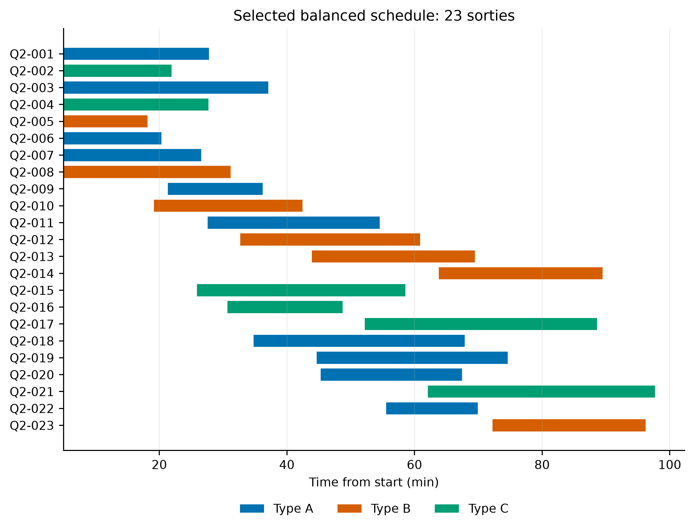

# 问题二：异构无人机多点多架次运输调度

## 按题目主要需求交付

1. 联合决定不可拆货箱组批、服务区访问顺序、机型、实体无人机、共享电池和起飞时刻；优化配送及时性、最晚返航、运输能耗和架次数并解释权衡。
2. 给出路线、架次、逐箱到达和无人机及电池资源使用情况，并独立验证资源可行性。

题面医疗物资及首批保障为硬时限。本项目采用更严格口径：80 箱全部按期；因此加权迟到均为零，权重在架次、最晚返航和能耗之间分配。

## 模型与算法

载质量、体积、卸货后剩余载荷、DEM 地形净空、爬升巡航下降时间、返航余量均按附件与公共物理模型核算。14 组同型共享电池记录独立 SOC，任务后按两阶段充电恢复至 100%，电池任务和充电不得冲突；8 架实体无人机不得执行重叠装载或飞行任务。

多服务区路线采用组批、拆分、任务箱转移/交换、机型选择、路线顺序和任务执行顺序等邻域，使用资源排程解码器确定实体机、电池和起飞时刻。权重实验采用模拟退火式多邻域搜索，相同共同种子池、每分支 30 秒预算；结果为有界搜索最优已知可行解，非精确动态规划或全局最优证明。算法历史路径的预算不同，算法表不作为公平速度竞赛。

**扩展假设**：下一架次固定准备可在本机上一架次起飞后开始，装载须待上一架返航；准备、装载与其他共享电池充电可并行，起飞前均须完成。题面未给准备工位数量，本方案按可并行准备计算。必须保留该假设说明。

## 已验证四方案

|方案|权重 N/T/E|架次|最晚返航/min|能耗/kWh|按期|校验|
|---|---|---:|---:|---:|---|---|
|架次优先|0.60/0.20/0.20|22|101.0272|67.1369|80/80|PASS|
|时间优先|0.10/0.65/0.25|23|95.6115|68.3045|80/80|PASS|
|能耗优先|0.10/0.20/0.70|23|98.1090|65.8231|80/80|PASS|
|综合均衡|1/3、1/3、1/3|23|97.7059|65.8691|80/80|PASS|

能耗优先最紧时限裕度 0.3818 min、最小能量安全裕度 0.0127 kWh；综合方案时限裕度 1.3818 min。参考图片只用于表格版式，不作为数据或可行方案来源。

## 结果位置

`results/q2_strategy_scenarios/`：算法与权重 CSV、可编辑 XLSX、两张对比 PNG、MATLAB 日志及四份 `*_best_pass.mat`。MAT 中的 `best.routes`、`best.sorties`、`best.boxDelivery` 分别提供路线和全部资源时序、逐架次表与逐箱交付表。`scoring_contract.txt` 给出冻结归一化公式；`round1/` 留存第一轮共同种子池。

## 复核与复现

需要 MATLAB R2022a（航段距离依赖 Mapping Toolbox）；表格图片打包需 Python、openpyxl、Pillow 和 Windows 微软雅黑字体。

原始题目与附件不在 Git 导入包中。把本地合法取得的附件放入 `input/`，保持原目录：

- `input/数据/无人机应急物资运输基础数据/调度中心与服务区.xlsx`
- 同目录 `运输无人机数据.xlsx`、`物资需求与配送时限.xlsx`
- `input/` 任意下级目录中的唯一 `*DEM.mat` 和 `*DEM.tif`

在导入后的目录进入 MATLAB：

```matlab
addpath('q2','common','utils');
verify_q2_github_bundle(pwd); % 鲜读数据并独立严格复核四份冻结结果
```

重新搜索：`run_q2_strategy_scenarios(pwd,30)`；重新核验出版：`publish_q2_strategy_tables(pwd)`。随机序列固定，但 30 秒壁钟预算使不同设备候选数量和新解可能变化；复核已保存排程应重现指标。PowerShell 启动器默认本机 MATLAB 路径，其他设备需修改。

## 最新图件与完整导出入口

补齐的[五组PNG/SVG](figures/q2_strategy_scenarios/)严格对应当前97.705871716 min综合均衡版，包括排程、电池飞行及充电、80箱时限裕度、权重权衡与算法策略比较；来源哈希见`scripts/q2_balanced_figure_sources.json`。原有两张对比表PNG仍在results/q2_strategy_scenarios/。



完整重新导出还需`input/结果提交模板.xlsx`。在本目录MATLAB依次运行`verify_q2_github_bundle(pwd)`、`publish_q2_strategy_tables(pwd)`、`export_q2_strategy_final`；再运行`python q2/package_q2_strategy_scenarios.py`生成比较工作簿和表格PNG，运行`python scripts/make_q2_balanced_figures.py`生成最新五图（需要matplotlib、numpy、openpyxl及需求原表）。更新后重建manifest，再执行`python verify_snapshot.py`核对发布文件。

`results/q2_99_review/`为曾交付的98.4931 min历史阶段，补齐其图表与核验文件仅为追溯，不能替代最新版。历史脚本不会作为默认最新入口自动执行。原附件不随包发布，按上文放置后方能重做物理核验；当前同步不重新搜索或改变任何已验收结果。

## 补齐路线、实体机阶段与流程图

当前图目录另外提供`result_q2_latest_routes`（23架次真实访问路线）、`process_q2_latest_uav_stages`（8架实体机的预准备、装载、飞行）和`flow_q2_latest_model`，均有PNG、SVG及灰度预览。它们直接读取冻结综合均衡MAT与官方表格，输入CSV和SHA256追溯文件位于结果目录；没有重新搜索。

安装`python -m pip install numpy matplotlib openpyxl Pillow h5py`。已有输入CSV可直接运行`python scripts/plot_latest_supplement.py`；从原附件重新提取则先运行`python scripts/export_latest_plot_inputs.py`，也可用`--source-root`指定原项目目录。准备时间300 s、每箱装载30 s已与三机型原表核对。更新清单：`python verify_snapshot.py --refresh`。
