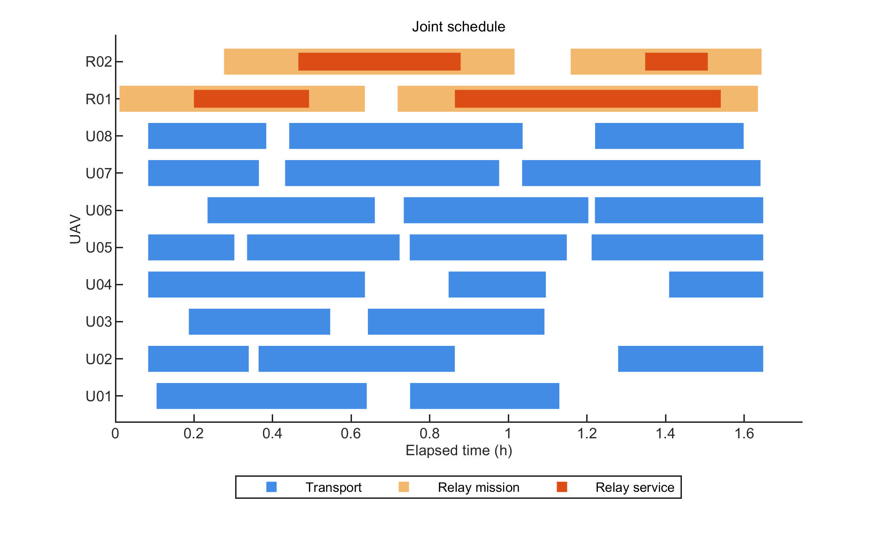

# 问题三：第二题运输方案 + 中继覆盖调度

## 题目要求与本方案

题目三在运输调度中加入全程通信约束，要求协调货箱批次、航线、运输机和电池、中继位置和服务时段，兼顾交付及时性、联合返航时间、总能耗和架次，并提交排程及覆盖结果。

本方案采用“继承第二题当前优选运输结构，再优化中继覆盖和资源时序”的策略。**冻结第二题路线结构是本方案的选择，不是原题对所有可行解的限制。**

|主要要求|处理方式与证据|
|---|---|
|运输与交付|继承指定 Q2 工作簿对应的 23 个分箱、访问顺序、机型和路线；80 箱全部在期望时限内交付|
|联合资源调度|允许现有同型运输机、电池重排及起飞时刻提前或延后；利用空闲窗口|
|连续通信|爬升、巡航、下降及交付全程，G01 直连或单中继；同时验证接入与回传链路|
|中继部署|4 个中继架次由 R01/R02 两架中继机执行，使用独立组件，不占用额外运输机|
|时间和能量|部署、建链、悬停、返航及周转分别计入；运输与中继并行|
|结果核验|MATLAB 物理与资源检查、连续区间证书、独立证书复核；不以离散采样替代连续证明|

## 已验证结果

|指标|数值|
|---|---:|
|重力加速度|9.806 m/s²|
|运输 / 中继架次|23 / 4|
|按期交付|80 / 80 箱|
|联合最晚返航|5933.082180813 s（98.884703014 min）|
|运输能耗|65.869091416 kWh|
|中继能耗|2.741650264 kWh|
|总能耗|68.610741681 kWh|
|通信未覆盖时长|0 s|
|连续验证|189 个阶段，296 个证书区间|

运输资源共 8 架飞机、14 组电池；中继资源共 2 架飞机、6 组组件，本解使用其中 4 组组件。相对基准改变了 11 个实体运输机分配、14 个电池分配、19 个起飞时刻。

**最优性范围：**固定所选站点、候选资源分配及任务次序后，MATLAB 时间优化阶段达到零 gap；这不是对全部站点、航线和资源组合的全局最优证明。参考截图只作外部比较，第二题基准不同，不能据此宣称同条件优于参考答案。

## 必须保留的模型口径

- 固定准备继承第二题预准备口径：同机上架次起飞后可开始下架次固定准备；装载仍须等待上架次返航；电池在下一次起飞前必须充满。初始准备与装载可重叠，同型电池可转移，充电采用实际两阶段时间。
- 上述预准备解释是本解成立的条件，应与严格“返航后才开始准备”的解释区分；详见[模型口径](results/q3_overlay/模型口径.md)。
- 运输与中继同时排程，没有“所有中继完成后才能运输”的限制；4 个中继架次不等于额外 4 台运输资源。
- 中继巡航高度由沿线最高 DEM + 50 m 确定；悬停高度不得超过巡航高度且离地不超过 300 m，不使用多跳中继。
- 原题医疗和首批时限等硬约束全部检查；本解另满足全部货箱期望时限，是更强的结果。

## 文件导航

- [最终提交工作簿](results/q3_overlay/Q3_结果提交.xlsx)：运输、逐箱交付、中继和通信结果；沿用模板的 Q2 工作表名称填入 Q3 实际运输排程。
- [汇总指标](results/q3_overlay/q3_metrics.csv)、[运输架次](results/q3_overlay/transport_sorties.csv)、[中继架次](results/q3_overlay/relay_sorties.csv)、[逐箱交付](results/q3_overlay/box_deliveries.csv)。
- [连续覆盖证书](results/q3_overlay/continuous_communication_certificate.csv)、[独立复核](results/q3_overlay/continuous_independent_audit.json)、[原运行 P2 验收记录](results/q3_overlay/P2_独立验收.md)、[六项检查](results/q3_overlay/六项检查与修正.md)。历史记录可能包含原工作目录；本包的可移植路径以本说明和 manifest.json 为准。
- [第二题原始基准](results/q2_strategy_scenarios/Q2_综合均衡最终结果.xlsx)及对应 MAT，保留原文件字节和 SHA256。
- [GitHub 后续任务指令](docs/GitHub任务指令.md)。



## MATLAB 运行

已验证环境为 MATLAB R2022a，需 Optimization Toolbox，以及原程序所用的数据/地理读取功能。仓库提供最终结果与计算代码；原题附件不在本分支重复发布。请将原附件放在：

```text
input/数据/无人机应急物资运输基础数据/
  调度中心与服务区.xlsx
  运输无人机数据.xlsx
  物资需求与配送时限.xlsx
  中继无人机数据.xlsx
  通信链路参数.xlsx
input/数据/镇龙乡地理空间数据/镇龙乡及周边地理数据/数字高程模型数据（DEM）/
  镇龙乡及周边30米DEM.mat
  镇龙乡及周边30米DEM.tif
```

在本目录执行：

```matlab
verify_q3_github_bundle(pwd) % 重建物理缓存并独立核验保存的最终排程
run_problem3               % 从 Q2 基准和所选候选重新运行 MATLAB 连续时间优化
```

`run_problem3` 会覆盖本包结果目录中的计算输出，建议先备份或在独立分支运行。它复算给定站点与候选资源次序，不重新做全部站点搜索。原运行的最终图表及验收记录作为已发布快照保留，重新优化后应更新对应验收记录和清单。

`q3/luna_flex_overlay_cpsat.py` 为可选候选生成器（Python、OR-Tools、openpyxl），不承担最终物理核验。提供的候选 CSV 已足够运行 MATLAB；候选整数时间不是最终时刻。最终数值来自 MATLAB 连续时间优化和独立约束检查。

`manifest.json` 记录本包发布文件的相对路径、大小与 SHA256；`input/`、`cache/` 和本机临时日志不提交。`logs/` 为原成功运行记录，新增包级复核见 `results/q3_overlay/github_bundle_validation.json`。
